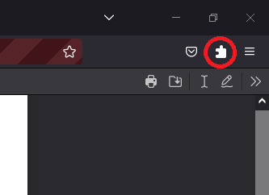
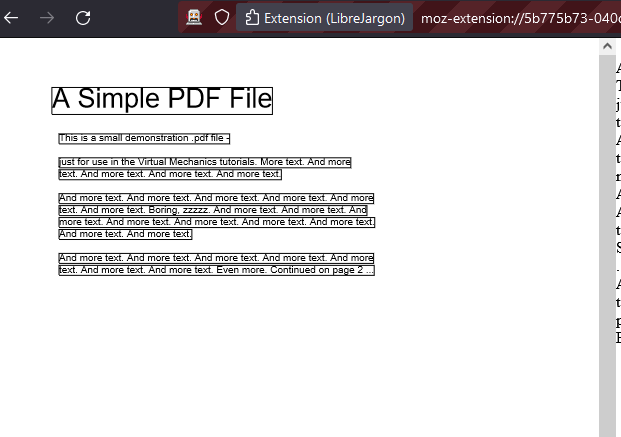

# LibreJargon

### An open-source jargon demystifier.
The aim of this extension is to lower the barriers to entry for research by providing an easy to use interface that will make reading scientific papers easier by automatically defining jargon, providing accessibility/display options, and linking similar articles for further reading. That way, online misinformation (Climate Change, Covid, etc.) can be disproven more easily by the general public.

## Features:
- Built-in PDF viewer
- Automatic jargon highlighting
- Reading list with Suggested Reading
- Highlight a word to get its definition

## Installation Instructions:
- Clone the repo into your folder of choice [git clone https://github.com/LibreJargon/LibreJargon.git]
- Navigate to the created folder [cd LibreJargon]
- Install the necessary packages [npm install]
  - NPM is a prerequisite for this project and can be found here: https://docs.npmjs.com/downloading-and-installing-node-js-and-npm
- Build the project [npm run build]
- Run the extension [npm run ext] or Run tests [npm run test]

## Technical Details
- When clicked, our extension attempts to open the current page as a PDF:

- If successful, the parsed PDF will appear on the left pane:

- And the text from that PDF will appear on the right pane. After selecting text, click the Define Jargon Page to Define that Word upon hovering:

- While the viewer is opened, click the extension button to open the log in page:

- Upon signing up or logging in, your account will be displayed showing you your personal reading list, suggested reading, jargon (jargon here will automatically be defined on web pages), and settings:

